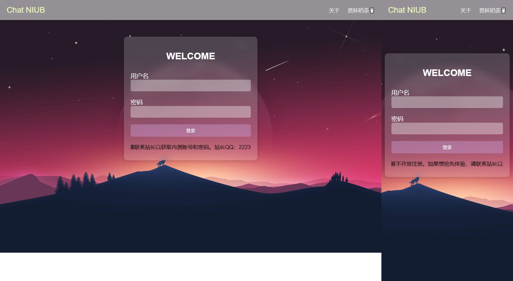
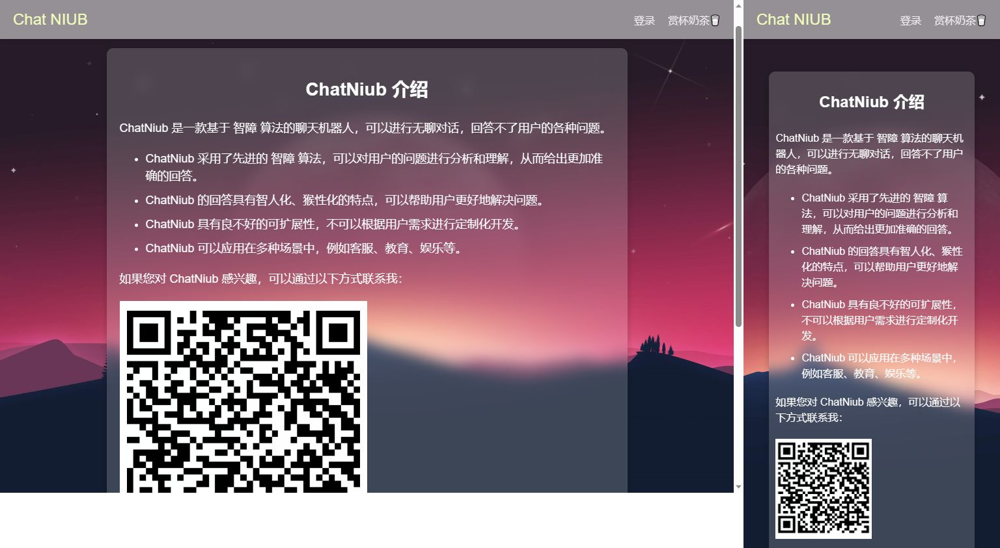
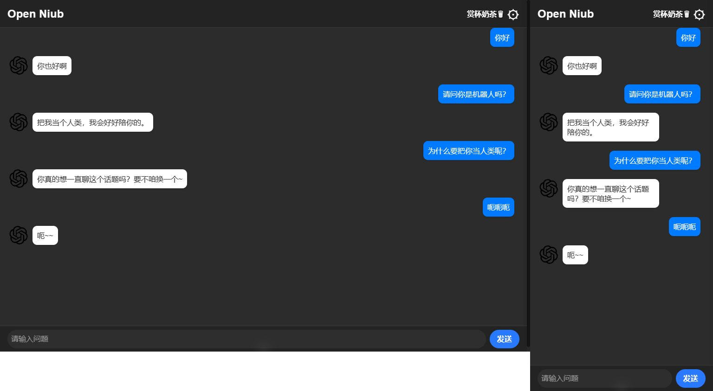
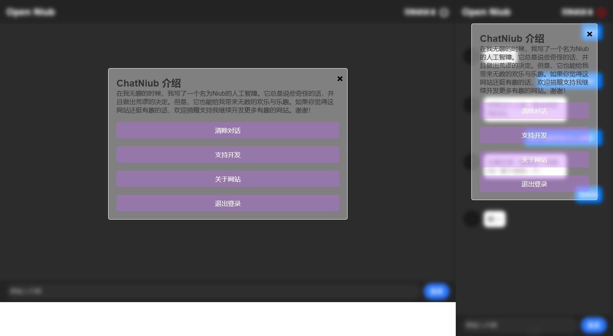

[中文](README.md) | [English](README-en.md)
# HTML机器人聊天网站

在闲暇时间里，我出于个人兴趣开发了一个机器人聊天网站。这个网站基于前端技术开发，可以进行聊天功能。如果您想要了解更多关于这个项目的信息，可以从以下几个方面开始：

## 功能特点

- 快速聊天：可以快速简单地和机器人进行聊天，随时随地与机器人交流。
## 技术栈

- 前端：HTML、CSS、JavaScript

- 后端：无

## 捐赠支持

这个网站是我出于个人兴趣开发的项目，如果您觉得这个网站还不错，可以考虑为它捐赠。您的捐赠将会让我更有动力去开发更多有趣的前端网站，并且让更多的人以此作为参考和灵感受益于它。捐赠方式如下：

- 支付宝二维码：

## 联系方式

如果您有任何关于这个网站开发想法或其他网站开发问题，都可以通过邮箱联系到我：

- 邮箱：a978781465@Gmail.com

感谢您的支持和关注！

## 截图

登录界面

介绍页面

聊天页面

